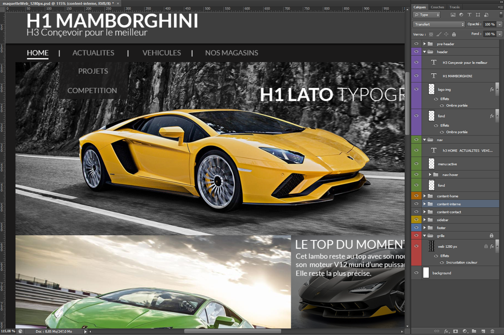

# Web design sur Photoshop | Intégration Web.
## Anthony VISOCCHI
### Janvier 2017


[Git Hub](https://github.com/anthoviso) - Anthony VISOCCHI.

```
! Projet en cours de développement.
! Document en cours de développement.

Ce fichier montre comment bien créer et organiser sa maquette
photoshop pour une meilleure compréhension du fichier et pour
permettre au développeur de gagner du temps.

```

[Voir le projet](https://github.com/anthoviso/Web-design---Web-Integration)
### La création

* Créez une page qui correspond au dimmensions des écrans sur les quels vous travaillez. Par exemple si nous travaillons pour un écran de tablette en format paysage, nous créons un document de 1024px de large.
* Vous trouverez les principales tailles d'écran utilisées pour le web [ici.](http://www.alsacreations.com/tuto/lire/547-faire-un-site-pour-toutes-les-resolutions.html)

### La structure

* Utilisez une grille sur votre nouvelle page, comme par exemple la grille Bootstrap qui est composée de 12 colonnes. Elle va vous permmettre de bien organiser votre document et surtout va faciliter la création de pages responsive.
* Tous vos calques seront organisés dans des dossiers (header, body, section, aside, footer, ...)
* Utilisez des codes couleurs pour permettre une lecture plus fluide de votre travail.
* Renommez vos calques en y indiquant à chaque fois un titre et un type. (ex : VoitureVerte. image)

### Les images

* Faites attention à la qualité des images que vous utilisez. Une image trop petite va pixeliser à l'écran et à l'inverse une image trop grande va être plus longue à charger sur le web. Pensez à redimmensionner vos images.
* Préparez un dossier avec les images à donner pour le développeur.

### Les couleurs

* Préparez un fichier avec toutes les couleurs utilisées en Hexadécimal et en RGB.
ex: #4c4c57 Color Hex - rgb(76,76,87)
* Vous trouverez toutes les informations couleurs sur [ce site](http://www.color-hex.com/)

### Les textes

* Indiquez le nom de la typographie, soit dans le titre dans calque, soit dans le texte affiché.
* Préparez un dossier avec toutes les fonts utilisées sur votre fichier. Vous pouvez utiliser [dafont](http://www.dafont.com/fr/) ou [1001fonts](http://www.1001fonts.com/) pour trouver votre police et la télécharger.
* Indiquez l'importance du texte Avec le nom de la balise pour le développeur (h1 *pour le titre*, h2 *sous-titres*, h3 *sous-sous-titres*, h4, p *texte*, ...). Par exemple pour mon titre : H1 Mamborghini
* Le h1 est unique dans la page et se trouve au début de celle-ci.
* Si vous n'avez pas d'idées sur le texte à écrire, [ce site](http://fr.lipsum.com/) vous permet de générer du texte.

### Les différents états

* Créez ou indiquez l'état de chaque élément, s'il est survolé avec la souris (*:hover*).
* Pour les liens, ou trouve aussi, s'il est actif (*:active*), s'il on maintient le clic sur celui-ci (*:focus*), s'il a été visité (*:visited*).
